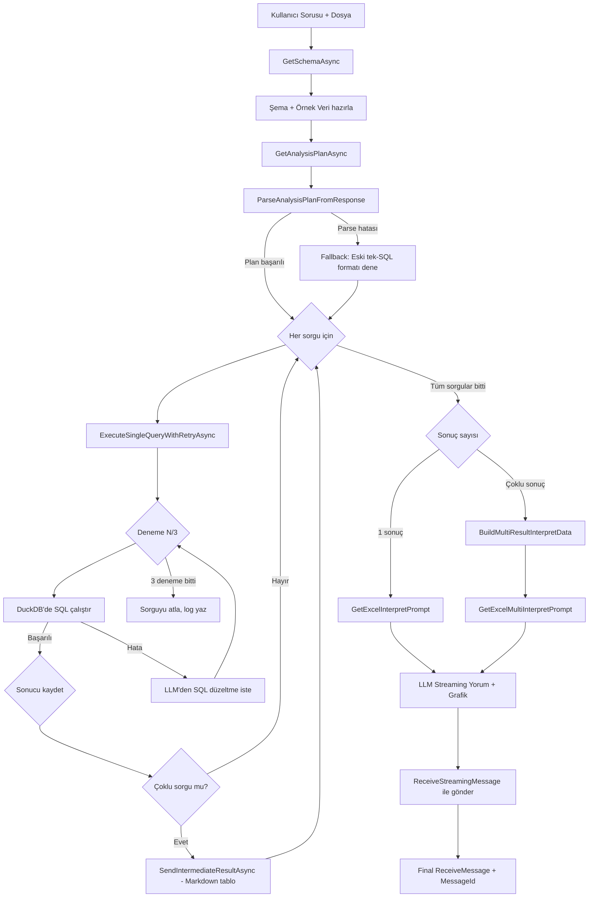
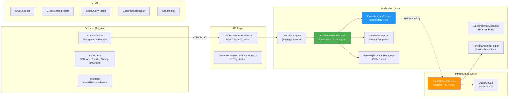

# 🦆 DuckDB Kullanım Analiz Raporu (Kapsamlı - 2. Analiz)

## 1. Genel Bakış

DuckDB, projede **Excel (.xlsx, .xls) ve CSV dosyalarını in-memory SQL ile analiz etmek** için kullanılıyor. Kullanıcı dosya yüklediğinde, LLM doğal dili SQL'e çevirir, DuckDB'de çalıştırır ve sonucu grafik + yorumla birlikte sunar.

| Özellik | Değer |
|---------|-------|
| **NuGet Paketleri** | `DuckDB.NET.Bindings` 1.4.3, `DuckDB.NET.Bindings.Full` 1.4.3, `DuckDB.NET.Data.Full` 1.4.3 |
| **Bağlantı Modu** | In-memory (`DataSource=:memory:`) |
| **DI Lifetime** | Scoped |
| **Desteklenen Formatlar** | `.xlsx`, `.xls`, `.csv` |
| **Maks Dosya Boyutu** | 100MB (frontend limiti) |
| **Maks Sonuç Satırı** | 1000 |
| **Sorgu Timeout** | 30 saniye |
| **Retry Sayısı** | 3 deneme (sorgu başına) |

---

## 2. End-to-End Akış (Frontend → DuckDB)

```mermaid
sequenceDiagram
    participant FE as Frontend<br/>chat.service.ts
    participant API as ConversationEndpoints<br/>POST /api/v1/chatbot
    participant Router as RouteConversationUseCase
    participant Agent as ChatActionAgent
    participant Chat as ExcelAnalysisUseCase
    participant Excel as DuckDbExcelService
    participant DB as DuckDB Engine
    participant LLM as OpenAI LLM
    participant SR as SignalR

    FE->>FE: validateFile() + fileToBase64()
    FE->>API: ChatRequest {prompt, fileBase64, fileName}
    API->>Router: OrchestrateAsync()
    Router->>Agent: HandleAsync() [action=chat]
    Agent->>Chat: GetStreamingChatResponseAsync()
    Chat->>Chat: IsSupported(fileName)?
    
    alt Excel/CSV dosyası
        Chat->>Excel: GetSchemaAsync(stream, fileName)
        Excel->>DB: INSTALL spatial; LOAD spatial;
        Excel->>DB: DESCRIBE SELECT * FROM st_read()
        Excel->>DB: SELECT COUNT(*) FROM st_read()
        Excel->>DB: SELECT * FROM st_read() LIMIT 5
        DB-->>Excel: ExcelSchemaResult
        Excel-->>Chat: Sütunlar, Tipler, Örnek Veri
        
        Chat->>LLM: GetAnalysisPlanAsync(şema + kullanıcı sorusu)
        LLM-->>Chat: ExcelAnalysisPlan {type, queries[]}
        
        loop Her sorgu için (1-8 sorgu)
            loop Maks 3 Deneme (sorgu başına)
                Chat->>Excel: ExecuteQueryAsync(stream, fileName, sql)
                Excel->>Excel: ValidateSql() + ReplacePlaceholders()
                Excel->>DB: SQL çalıştır
                alt Başarılı
                    DB-->>Excel: ExcelQueryResult ✅
                else Hata
                    DB-->>Excel: Hata mesajı
                    Chat->>LLM: Hata ile düzeltme iste
                end
            end
            opt Çoklu sorgu modunda
                Chat->>SR: SendIntermediateResultAsync (Markdown tablo)
                SR-->>FE: ReceiveMessage (bağımsız mesaj)
            end
        end
        
        Chat->>Chat: BuildMultiResultInterpretData(allResults)
        Chat->>LLM: Tüm sonuçları yorumla + grafik oluştur
        LLM-->>SR: Streaming yanıt (Markdown + grafik)
        SR-->>FE: ReceiveStreamingMessage → parseMarkdownContent()
    end
```

---

## 3. Tüm DuckDB İlişkili Dosyalar (19 Dosya)

### 3.1. Backend — Kaynak Kod (11 dosya)

| # | Dosya | Katman | Satır | Rol |
|---|-------|--------|-------|-----|
| 1 | [AI.Infrastructure.csproj](file:///Users/ahmettugur/Desktop/Appliactions/CursorSamples/AIApplications/backend/AI.Infrastructure/AI.Infrastructure.csproj) | Infrastructure | — | NuGet paket referansları (3 paket) |
| 2 | [DuckDbExcelService.cs](file:///Users/ahmettugur/Desktop/Appliactions/CursorSamples/AIApplications/backend/AI.Infrastructure/Adapters/AI/ExcelServices/DuckDbExcelService.cs) | Infrastructure (Adapter) | 436 | ⭐ Ana DuckDB implementasyonu |
| 3 | [IExcelAnalysisService.cs](file:///Users/ahmettugur/Desktop/Appliactions/CursorSamples/AIApplications/backend/AI.Application/Ports/Secondary/Services/Report/IExcelAnalysisService.cs) | Application (Port) | 50 | Interface tanımı (5 metot) |
| 4 | [ExcelAnalysisUseCase.cs](file:///Users/ahmettugur/Desktop/Appliactions/CursorSamples/AIApplications/backend/AI.Application/UseCases/ExcelAnalysisUseCase.cs) | Application (UseCase) | - | ⭐ Multi-query orkestrasyon + Retry mekanizması |
| 5 | [IExcelAnalysisUseCase.cs](file:///Users/ahmettugur/Desktop/Appliactions/CursorSamples/AIApplications/backend/AI.Application/Ports/Primary/UseCases/IExcelAnalysisUseCase.cs) | Application (Port) | - | Primary Port interface |
| 6 | [ChatActionAgent.cs](file:///Users/ahmettugur/Desktop/Appliactions/CursorSamples/AIApplications/backend/AI.Application/UseCases/ActionAgents/ChatActionAgent.cs) | Application (Agent) | 46 | Routing agent → `GetStreamingChatResponseAsync` |
| 7 | [ConversationEndpoints.cs](file:///Users/ahmettugur/Desktop/Appliactions/CursorSamples/AIApplications/backend/AI.Api/Endpoints/History/ConversationEndpoints.cs) | API (Endpoint) | 114 | `POST /api/v1/chatbot` API endpoint |
| 8 | [DependencyInjectionExtensions.cs](file:///Users/ahmettugur/Desktop/Appliactions/CursorSamples/AIApplications/backend/AI.Api/Extensions/DependencyInjectionExtensions.cs) | API (DI) | — | `AddScoped<IExcelAnalysisService, DuckDbExcelService>()` |
| 9 | [SystemPrompt.cs](file:///Users/ahmettugur/Desktop/Appliactions/CursorSamples/AIApplications/backend/AI.Application/Common/Resources/Prompts/SystemPrompt.cs) | Application (Prompts) | — | 4 prompt metodu (plan, SQL, interpret, multi-interpret) |
| 10 | [TurkishEncodingHelper.cs](file:///Users/ahmettugur/Desktop/Appliactions/CursorSamples/AIApplications/backend/AI.Application/Common/Helpers/TurkishEncodingHelper.cs) | Application (Helper) | — | `SanitizeTableName()` — Türkçe → ASCII dönüşümü |
| 11 | [ChatRequest.cs](file:///Users/ahmettugur/Desktop/Appliactions/CursorSamples/AIApplications/backend/AI.Application/DTOs/Chat/ChatRequest.cs) | Application (DTO) | 14 | `FileBase64` + `FileName` giriş noktası |

### 3.2. DTO Sınıfları (6 dosya)

| # | DTO | Dosya | Alanlar |
|---|-----|-------|---------|
| 12 | `ExcelSchemaResult` | [ExcelSchemaResult.cs](file:///Users/ahmettugur/Desktop/Appliactions/CursorSamples/AIApplications/backend/AI.Application/DTOs/ExcelAnalysis/ExcelSchemaResult.cs) | `TableName`, `RowCount`, `Columns`, `SampleRows` |
| 13 | `ExcelQueryResult` | [ExcelQueryResult.cs](file:///Users/ahmettugur/Desktop/Appliactions/CursorSamples/AIApplications/backend/AI.Application/DTOs/ExcelAnalysis/ExcelQueryResult.cs) | `ExecutedSql`, `Data`, `Columns`, `RowCount`, `ExecutionTimeMs` |
| 14 | `ExcelAnalysisResult` | [ExcelAnalysisResult.cs](file:///Users/ahmettugur/Desktop/Appliactions/CursorSamples/AIApplications/backend/AI.Application/DTOs/ExcelAnalysis/ExcelAnalysisResult.cs) | `Schema`, `GeneratedSql`, `QueryResult`, `Explanation` |
| 15 | `ColumnInfo` | [ColumnInfo.cs](file:///Users/ahmettugur/Desktop/Appliactions/CursorSamples/AIApplications/backend/AI.Application/DTOs/ExcelAnalysis/ColumnInfo.cs) | `Name`, `DataType`, `IsNullable`, `SampleValues` |
| 16 | `ExcelAnalysisPlan` | [ExcelAnalysisPlan.cs](file:///Users/ahmettugur/Desktop/Appliactions/CursorSamples/AIApplications/backend/AI.Application/DTOs/ExcelAnalysis/ExcelAnalysisPlan.cs) | `AnalysisType` (single/comprehensive), `Queries` (List<AnalysisQuery>) |
| 17 | `AnalysisQueryResult` | [AnalysisQueryResult.cs](file:///Users/ahmettugur/Desktop/Appliactions/CursorSamples/AIApplications/backend/AI.Application/DTOs/ExcelAnalysis/AnalysisQueryResult.cs) | `Title`, `Description`, `ExecutedSql`, `QueryResult`, `Success` |

### 3.3. Prompt Şablonları (4 dosya)

| # | Dosya | Satır | Amaç |
|---|-------|-------|------|
| 18 | [excel_analysis_plan_prompt.md](file:///Users/ahmettugur/Desktop/Appliactions/CursorSamples/AIApplications/backend/AI.Application/Common/Resources/Prompts/excel_analysis_plan_prompt.md) | - | Çoklu SQL analiz planı üretme (single/comprehensive) |
| 19 | [excel_sql_generator_prompt.md](file:///Users/ahmettugur/Desktop/Appliactions/CursorSamples/AIApplications/backend/AI.Application/Common/Resources/Prompts/excel_sql_generator_prompt.md) | 89 | LLM'den SQL üretimi (güvenlik kuralları + JSON çıktı formatı) — fallback |
| 20 | [excel_interpret_prompt.md](file:///Users/ahmettugur/Desktop/Appliactions/CursorSamples/AIApplications/backend/AI.Application/Common/Resources/Prompts/excel_interpret_prompt.md) | 201 | Tek sonuç yorumlama + grafik üretimi (ApexCharts/Chart.js/amCharts) |
| 21 | [excel_multi_interpret_prompt.md](file:///Users/ahmettugur/Desktop/Appliactions/CursorSamples/AIApplications/backend/AI.Application/Common/Resources/Prompts/excel_multi_interpret_prompt.md) | - | Çoklu sonuç birleştirme ve kapsamlı rapor yorumlama |

### 3.4. Frontend (2 dosya)

| # | Dosya | Rol |
|---|-------|-----|
| 18 | [chat.service.ts](file:///Users/ahmettugur/Desktop/Appliactions/CursorSamples/AIApplications/frontend/src/app/core/services/chat.service.ts) | Dosya yükleme, Base64 dönüşümü, validasyon (100MB, uzantı kontrolü) |
| 19 | [index.html](file:///Users/ahmettugur/Desktop/Appliactions/CursorSamples/AIApplications/frontend/src/index.html) | CDN: ApexCharts, Chart.js 4.5.1, amCharts 5 (DuckDB grafiklerini render eder) |

---

## 4. DuckDbExcelService — Metot Detayları

### 4.1. Public Metotlar

| Metot | Satır | İşlev |
|-------|-------|-------|
| `GetSupportedExtensions()` | 34 | `.xlsx`, `.xls`, `.csv` döndürür |
| `IsSupported(fileName)` | 36-43 | Uzantı kontrolü |
| `GetSchemaAsync(stream, fileName)` | 45-99 | Şema çıkarma (sütunlar, tipler, satır sayısı, 5 örnek satır) |
| `ExecuteQueryAsync(stream, fileName, sql)` | 101-189 | SQL güvenlik kontrolü + çalıştırma (maks 1000 satır, 30s timeout) |
| `AnalyzeAsync(stream, fileName, query)` | 191-231 | Şemayı çıkarır, SQL üretimini UseCase'e bırakır |
| `GenerateHtmlTable(result)` | 393-433 | ⚠️ **DEAD CODE** — Hiçbir yerden çağrılmıyor |

### 4.2. Private Yardımcı Metotlar

| Metot | İşlev |
|-------|-------|
| `SaveToTempFileAsync` | Stream'i `/tmp/duckdb_{GUID}.ext` olarak kaydeder |
| `CleanupTempFile` | Geçici dosyayı siler (finally bloğunda) |
| `LoadExtensionsAsync` | Excel için `INSTALL spatial; LOAD spatial;` |
| `GetReadFunction` | `.xlsx`→`st_read()`, `.csv`→`read_csv(auto_detect=true)` |
| `GetColumnsAsync` | `DESCRIBE SELECT *` ile sütun bilgisi |
| `GetRowCountAsync` | `SELECT COUNT(*)` |
| `GetSampleRowsAsync` | `SELECT * LIMIT N` |
| `ValidateSql` | SELECT-only + yasaklı anahtar kelime kontrolü |
| `ReplacePlaceholders` | Tablo adı → `st_read()`/`read_csv()` dönüşümü |

---

## 5. Güvenlik Mekanizmaları (3 Katman)

### Katman 1: Frontend (`chat.service.ts`)
- Dosya boyutu limiti: **100MB**
- Uzantı whitelist: `.xlsx`, `.xls`, `.csv`, `.pdf`, `.docx`, `.doc`, `.txt`, `.pptx`, `.ppt`
- MIME type kontrolü

### Katman 2: Prompt Seviyesi (`excel_sql_generator_prompt.md`)
- LLM injection koruması (rol değiştirme, jailbreak tespiti)
- SQL injection kalıpları: `'; DROP`, `1=1`, `UNION SELECT`, `--`, `/*`
- Güvenlik ihlali → `{"sql": null, "error": "security_violation"}` JSON yanıtı

### Katman 3: Kod Seviyesi (`DuckDbExcelService.ValidateSql`)
```
├── Boş SQL → ArgumentException
├── SELECT ile başlamıyorsa → SecurityException
└── Yasaklı kelimeler → SecurityException
    DROP, DELETE, INSERT, UPDATE, TRUNCATE, ALTER, CREATE, EXEC, EXECUTE
```

---

## 6. Multi-Query Analiz Akışı (`ProcessExcelQueryAsync`)

[ExcelAnalysisUseCase.cs](file:///Users/ahmettugur/Desktop/Appliactions/CursorSamples/AIApplications/backend/AI.Application/UseCases/ExcelAnalysisUseCase.cs)



**Önemli detaylar:**
- `Temperature = 0.1` (analiz planı + SQL üretimi — düşük yaratıcılık)
- `Temperature = 0.3` (yorum/grafik — orta yaratıcılık)
- `ToonSerializer` kullanılır (LLM-optimize, satır-tabanlı veri formatı)
- `ParseAnalysisPlanFromResponse`: JSON `{"analysis_type": "...", "queries": [...]}` parse eder, fallback olarak eski `ParseSqlFromLlmResponse` kullanılır
- Ara sonuçlar Markdown tablo olarak `ReceiveMessage` ile gönderilir (frontend'deki `parseMarkdownContent()` render eder)
- Başarısız sorgular atlanır, en az 1 başarılı sonuç gereklidir

---

## 7. Frontend Render Mekanizması

DuckDB sonuçları iki kanaldan render edilir:

### 7.1. Ara Tablo Sonuçları (Çoklu Sorgu Modunda)
- `SendIntermediateResultAsync` → **Markdown tablo** olarak `ReceiveMessage` ile gönderilir
- Frontend `handleReceiveMessage()` ile bağımsız AI mesaj baloncuğu olarak eklenir
- `parseMarkdownContent()` ile Markdown → HTML render edilir
- CSS/stil değişiklikleri frontend tarafında yönetilir (backend'de inline style yok)

### 7.2. LLM Streaming Yorumu
- LLM'in ürettiiği **Markdown + grafik HTML** streaming olarak `ReceiveStreamingMessage` ile gönderilir
- `excel_interpret_prompt.md` / `excel_multi_interpret_prompt.md` → LLM'e grafik talimatı verilir
- LLM, `<div>` + `<script>` içeren HTML grafikler üretir
- Frontend `chat.html` → `[innerHTML]="message.content | safeHtml"` ile render eder
- `index.html`'deki CDN kütüphaneleri grafiği çizer:
   - **ApexCharts** (latest) — Önerilen varsayılan
   - **Chart.js** 4.5.1 — Hafif alternatif
   - **amCharts 5** — Gelişmiş grafikler (xy, percent, Animated theme)

---

## 8. OpenTelemetry Entegrasyonu

| Activity Adı | Tag'ler |
|---|---|
| `DuckDB_GetSchema` | `file.name`, `columns.count`, `rows.count` |
| `DuckDB_ExecuteQuery` | `file.name`, `result.rows`, `execution.ms` |
| `DuckDB_Analyze` | `file.name`, `user.query` |
| `ProcessExcelQuery` | `file.name`, `user.query`, `attempt.N`, `successful.attempt`, `result.rows`, `execution.ms`, `all.attempts.failed` |

---

## 9. Mimari Yapı



---

## 10. Tespit Edilen Sorunlar

> [!WARNING]
> ### ⚠️ Dead Code: `GenerateHtmlTable`
> [DuckDbExcelService.cs#L393-L433](file:///Users/ahmettugur/Desktop/Appliactions/CursorSamples/AIApplications/backend/AI.Infrastructure/Adapters/AI/ExcelServices/DuckDbExcelService.cs#L393-L433) — 40 satırlık `public static` metot **hiçbir yerden çağrılmıyor**. LLM artık doğrudan HTML grafik ürettiği için bu metot gereksiz hale gelmiş olabilir.

> [!NOTE]
> ### ℹ️ `AnalyzeAsync` Kısıtlı Kullanım
> `AnalyzeAsync` metodu sadece şema çıkarır ve SQL üretimini UseCase'e bırakır. `ExcelAnalysisUseCase` doğrudan `GetSchemaAsync` + `ExecuteQueryAsync` kullanır.

> [!NOTE]
> ### ℹ️ `ColumnInfo.SampleValues` Kullanılmıyor
> `ColumnInfo` DTO'sundaki `SampleValues` alanı `GetColumnsAsync` içinde doldurulmuyor ve hiçbir yerde kullanılmıyor.

---

## 11. Konfigürasyon Sabitleri Özeti

| Sabit | Değer | Konum |
|-------|-------|-------|
| `SupportedExtensions` | `.xlsx`, `.xls`, `.csv` | `DuckDbExcelService` |
| `MaxSampleRows` | 5 | `DuckDbExcelService` |
| `MaxResultRows` | 1000 | `DuckDbExcelService` |
| `QueryTimeoutSeconds` | 30 | `DuckDbExcelService` |
| `maxRetries` | 3 (sorgu başına) | `ExcelAnalysisUseCase.ExecuteSingleQueryWithRetryAsync` |
| `Temperature` (SQL) | 0.1 | `ExcelAnalysisUseCase` |
| `Temperature` (yorum) | 0.3 | `ExcelAnalysisUseCase` |
| `maxFileSize` | 100MB | Frontend `chat.service.ts` |
| `supportedExtensions` | 9 uzantı (xlsx, csv, pdf, docx...) | Frontend `chat.service.ts` |

---

## 12. DuckDB Extension Desteği

| Format | DuckDB Fonksiyonu | Extension | Komut |
|--------|-------------------|-----------|-------|
| `.xlsx` | `st_read('path')` | ✅ `spatial` | `INSTALL spatial; LOAD spatial;` |
| `.xls` | `st_read('path')` | ✅ `spatial` | `INSTALL spatial; LOAD spatial;` |
| `.csv` | `read_csv('path', auto_detect=true, header=true)` | ❌ Yok | — |

---

## İlgili Dökümanlar

| Döküman | Açıklama |
|---------|----------|
| [DuckDB-Excel.md](DuckDB-Excel.md) | DuckDB Excel/CSV analiz sistemi detaylı analiz |
| [System-Overview.md](System-Overview.md) | Genel sistem mimarisi |
| [Application-Layer.md](Application-Layer.md) | UseCase katmanı detayları |
| [Chat-System.md](Chat-System.md) | Chat sistemi özellikleri |
