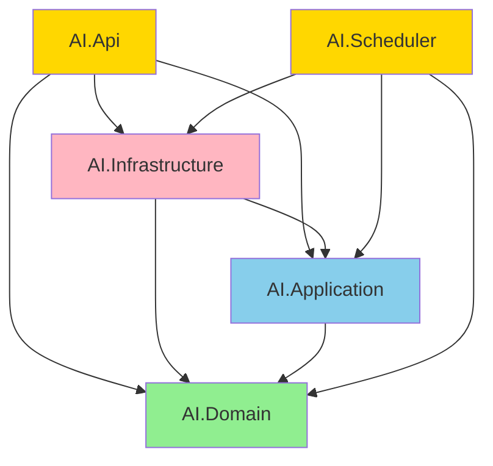

# Hexagonal Architecture (Ports & Adapters) Uygunluk Raporu

## Hexagonal Mimari Yapısı

```
                    ┌─────────────────────────────────────┐
                    │         PRIMARY ADAPTERS            │
                    │   (Driving/Left Side of Hexagon)    │
                    │                                     │
                    │  AI.Api/Endpoints/                  │
                    │  AI.Api/Hubs/                       │
                    │  AI.Scheduler/Jobs/                 │
                    └──────────────┬──────────────────────┘
                                   │ calls
                                   ▼
┌─────────────────────────────────────────────────────────────────────────┐
│                              HEXAGON                                    │
│                         (Application Core)                              │
│                                                                         │
│  ┌─────────────────────┐              ┌─────────────────────────────┐   │
│  │   PRIMARY PORTS     │              │      SECONDARY PORTS        │   │
│  │   (Driving Ports)   │              │      (Driven Ports)         │   │
│  │                     │              │                             │   │
│  │ Ports/Primary/      │   UseCases/  │  Ports/Secondary/           │   │
│  │ UseCases/           │──────────────│  ├── Repositories/          │   │
│  │ ├── IAuthUseCase    │              │  ├── Services/              │   │
│  │ ├── IRagSearchSvc   │              │  ├── Notifications/         │   │
│  │ ├── IConversationUseCase │         │  └── Scheduling/            │   │
│  │ └── ...             │              │                             │   │
│  └─────────────────────┘              └─────────────────────────────┘   │
│                                                                         │
│                         AI.Application                                  │
│                            + AI.Domain                                  │
└─────────────────────────────────────────────────────────────────────────┘
                                   │ uses
                                   ▼
                    ┌─────────────────────────────────────┐
                    │        SECONDARY ADAPTERS           │
                    │   (Driven/Right Side of Hexagon)    │
                    │                                     │
                    │  AI.Infrastructure/Adapters/        │
                    │  ├── Persistence/Repositories/      │
                    │  ├── AI/VectorServices/             │
                    │  ├── External/Caching/              │
                    │  └── External/DatabaseServices/     │
                    └─────────────────────────────────────┘
```

---

## 1. Proje Yapısı

```
AIApplications/
├── AI.Domain              # Core Entities (En içteki katman)
├── AI.Application         # Hexagon (Ports + UseCases)
├── AI.Infrastructure      # Secondary Adapters (Sağ taraf)
├── AI.Api                 # Primary Adapters (Sol taraf) + Composition Root
└── AI.Scheduler           # Primary Adapters (Sol taraf)
```

### Proje Referansları

#### AI.Domain

```xml
<ItemGroup>
  <PackageReference Include="System.ComponentModel.Annotations" Version="5.0.0" />
</ItemGroup>
```

**Durum:** ✅ Hiçbir projeye bağımlı değil

#### AI.Application (Hexagon)

```xml
<ItemGroup>
  <ProjectReference Include="..\AI.Domain\AI.Domain.csproj" />
</ItemGroup>
```

**Durum:** ✅ Sadece Domain'e bağımlı - Infrastructure referansı YOK

#### AI.Infrastructure (Secondary Adapters)

```xml
<ItemGroup>
  <ProjectReference Include="..\AI.Domain\AI.Domain.csproj" />
  <ProjectReference Include="..\AI.Application\AI.Application.csproj" />
</ItemGroup>
```

**Durum:** ✅ Application ve Domain'e bağımlı (Port'ları implement etmek için)

#### AI.Api (Primary Adapters + Composition Root)

```xml
<ItemGroup>
  <ProjectReference Include="..\AI.Domain\AI.Domain.csproj" />
  <ProjectReference Include="..\AI.Application\AI.Application.csproj" />
  <ProjectReference Include="..\AI.Infrastructure\AI.Infrastructure.csproj" />
</ItemGroup>
```

**Durum:** ✅ Composition Root olarak tüm katmanlara erişebilir

---

## 2. HEXAGON (Application Core)

**Konum:** `AI.Application` + `AI.Domain`

### Hexagon Bağımsızlığı

| Kontrol | Durum | Açıklama |
|---------|-------|----------|
| Infrastructure Bağımlılığı | ✅ YOK | `using AI.Infrastructure` bulunamadı |
| API Bağımlılığı | ✅ YOK | `using AI.Api` bulunamadı |
| Domain Bağımlılığı | ✅ VAR | Sadece `AI.Domain` referansı |
| İş Mantığı Encapsulation | ✅ | UseCases/ klasöründe |

---

## 3. PRIMARY PORTS (Driving Ports)

**Konum:** `AI.Application/Ports/Primary/UseCases/`

| Port Interface | Amacı |
|----------------|-------|
| `IAIChatUseCase` | Chat ve doküman arama işlemleri |
| `IAuthUseCase` | Kimlik doğrulama işlemleri |
| `IContextSummarizationUseCase` | Context özetleme |
| `IConversationUseCase` | Conversation geçmişi yönetimi |
| `IDashboardQueryUseCase` | Dashboard SQL sorgulama işlemleri |
| `IDashboardUseCase` | Dashboard işlemleri |
| `IDocumentCategoryUseCase` | Doküman kategori yönetimi |
| `IDocumentDisplayInfoUseCase` | Doküman görüntüleme bilgisi |
| `IDocumentMetadataUseCase` | Doküman metadata yönetimi |
| `IDocumentProcessingUseCase` | Döküman işleme |
| `IExcelAnalysisUseCase` | Excel/CSV dosya analizi (DuckDB) |
| `IFeedbackAnalysisUseCase` | Geri bildirim analizi |
| `IFeedbackUseCase` | Feedback CRUD işlemleri |
| `IRagSearchUseCase` | RAG tabanlı arama |
| `IReActUseCase` | Merkezi ReAct düşünme-gözlem döngüsü |
| `IReportMetadataUseCase` | Rapor metadata yönetimi |
| `IRouteConversationUseCase` | Chat conversation yönlendirme |
| `IScheduledReportUseCase` | Zamanlanmış rapor yönetimi |
| `IUserMemoryUseCase` | Kullanıcı long-term memory |

**Primary Port Implementasyonları:** `AI.Application/UseCases/` klasöründe

---

## 4. SECONDARY PORTS (Driven Ports)

**Konum:** `AI.Application/Ports/Secondary/`

```
Ports/Secondary/
├── Services/                  # 34 Service Interface
│   ├── AIChat/                # IDynamicPromptBuilder, IReranker, ISelfQueryExtractor
│   ├── AgentCore/             # IActionAgent, IActionAgentRegistry
│   ├── Auth/                  # ICurrentUserService, ITokenService
│   ├── Cache/                 # IChatCacheService
│   ├── Common/                # IFileSaver, ISignalRHubContext
│   ├── Database/              # IDatabaseService, ISqlAgentPipeline, ISchemaGraphService...
│   ├── Document/              # IDocumentParser, ITextChunker, IDocumentCacheService...
│   ├── Query/                 # IConversationQueryService, IFeedbackQueryService...
│   ├── Report/                # IExcelAnalysisService, IDashboardParser, IReportService...
│   └── Vector/                # IQdrantService, IEmbeddingService, ISparseVectorService
│
├── Notifications/             # 3 Notification Interface
│   ├── IEmailNotificationService.cs
│   ├── INotificationService.cs
│   └── ITeamsNotificationService.cs
│
└── Scheduling/                # 2 Scheduling Interface
    ├── IJobScheduler.cs
    └── ISchedulerDataService.cs
```

> **Not:** Repository interface'leri `AI.Domain` katmanında tanımlıdır (DDD: aggregate root'lar kendi repository interface'lerini tanımlar).

---

## 5. PRIMARY ADAPTERS (Driving Adapters)

**Konum:** `AI.Api/Endpoints/`, `AI.Api/Hubs/`, `AI.Scheduler/Jobs/`

### API Endpoints (REST Adapters)

| Primary Adapter | Kullandığı Primary Port |
|-----------------|-------------------------|
| `AuthEndpoints.cs` | `IAuthUseCase` |
| `DocumentEndpoints.cs` | `IDocumentProcessingUseCase`, `IDocumentCategoryUseCase`, `IDocumentDisplayInfoUseCase` |
| `SearchEndpoints.cs` | `IRagSearchUseCase` |
| `ConversationEndpoints.cs` | `IConversationUseCase` |
| `DashboardEndpoints.cs` | `IDashboardQueryUseCase`, `IDashboardUseCase` |
| `FeedbackEndpoints.cs` | `IFeedbackUseCase`, `IFeedbackAnalysisUseCase` |
| `ScheduledReportEndpoints.cs` | `IScheduledReportUseCase` |
| `HistoryEndpoints.cs` | `IConversationUseCase` |
| `CommonEndpoints.cs` | `IDashboardQueryUseCase` |
| `AdventureWorksReportEndpoints.cs` | `IReportMetadataUseCase`, `IDashboardUseCase` |
| `Neo4jEndpoints.cs` | `ISchemaGraphService` |

### SignalR Hub (WebSocket Adapter)

| Primary Adapter | Kullandığı Primary Port |
|-----------------|-------------------------|
| `AIHub.cs` | `IRouteConversationUseCase` |

### Scheduler Jobs (Background Job Adapters)

| Primary Adapter | Kullandığı Secondary Port |
|-----------------|---------------------------|
| `ScheduledReportJob.cs` | `ISchedulerDataService`, `INotificationService` |
| `FeedbackAnalysisJob.cs` | `IFeedbackAnalysisUseCase` |
| `ReportSchedulerJob.cs` | `IScheduledReportUseCase` |

### Örnek: Doğru Primary Adapter Kullanımı

```csharp
// AI.Api/Endpoints/Documents/DocumentEndpoints.cs
public static void MapDocumentEndpoints(this IEndpointRouteBuilder app)
{
    // ✅ Primary Port (IDocumentProcessingUseCase) kullanılıyor
    app.MapPost("/api/v{version:apiVersion}/documents/upload",
        async (IDocumentProcessingUseCase service, IFormFile file) =>
        {
            var result = await service.ProcessDocumentFromUploadAsync(uploadDto, stream);
            return Results.Ok(result);
        });
}
```

```csharp
// AI.Scheduler/Jobs/ScheduledReportJob.cs
public sealed class ScheduledReportJob
{
    // ✅ Secondary Ports kullanılıyor (not Infrastructure concrete classes)
    private readonly ISchedulerDataService _dataService;
    private readonly INotificationService _notificationService;
    
    public ScheduledReportJob(
        ISchedulerDataService dataService,
        INotificationService notificationService)
    {
        _dataService = dataService;
        _notificationService = notificationService;
    }
}
```

---

## 6. SECONDARY ADAPTERS (Driven Adapters)

**Konum:** `AI.Infrastructure/Adapters/`

```
Adapters/
├── Persistence/               # Database Adapters
│   ├── Repositories/          # PostgreSqlHistoryRepository, UserRepository...
│   ├── Configurations/        # EF Core Entity Configurations
│   ├── Migrations/            # Database Migrations
│   └── ChatDbContext.cs       # DbContext
│
├── AI/                        # AI Service Adapters
│   ├── VectorServices/        # QdrantService, OpenAIEmbeddingService
│   ├── DocumentServices/      # PdfDocumentParser, TextChunker, DocumentCategoryService
│   ├── ExcelServices/         # DuckDbExcelService
│   ├── Reports/               # SqlServerReportService
│   ├── ReadyReports/          # AdventureWorksReadyReportService
│   ├── Neo4j/                 # SchemaGraphService, SchemaParserService
│   ├── Reranking/             # LLMReranker
│   ├── SelfQuery/             # SelfQueryExtractor
│   └── Agents/SqlAgents/      # SqlAgentPipeline, SqlValidationAgent, SqlOptimizationAgent
│
├── External/                  # External System Adapters
│   ├── Caching/               # RedisCacheService, InMemoryCacheService, DocumentCacheService
│   ├── DatabaseServices/      # SqlServerDatabaseService, SqlServerConnectionFactory
│   ├── Scheduling/            # HangfireJobScheduler, SchedulerDataService
│   ├── Notifications/         # NotificationService
│   └── TokenService.cs        # JWT Token Service
│
└── Common/                    # Common Adapters
    └── CurrentUserService.cs  # HTTP Context User Service
```

### Port → Adapter Eşleşme Tablosu

| Secondary Port | Secondary Adapter | Konum |
|----------------|-------------------|-------|
| `IConversationRepository` | `PostgreSqlConversationRepository` | Persistence/Repositories |
| `IUserRepository` | `UserRepository` | Persistence/Repositories |
| `IQdrantService` | `QdrantService` | AI/VectorServices |
| `IEmbeddingService` | `OpenAIEmbeddingService` | AI/VectorServices |
| `ISparseVectorService` | `SparseVectorService` | AI/VectorServices |
| `IDocumentParser` | `PdfDocumentParser`, `TextDocumentParser` | AI/DocumentServices |
| `ITextChunker` | `TextChunker` | AI/DocumentServices |
| `IDatabaseService` | `SqlServerDatabaseService` | External/DatabaseServices |
| `IChatCacheService` | `RedisCacheService`, `InMemoryCacheService` | External/Caching |
| `IDocumentCacheService` | `DocumentCacheService` | External/Caching |
| `IJobScheduler` | `HangfireJobScheduler` | External/Scheduling |
| `ISchedulerDataService` | `SchedulerDataService` | External/Scheduling |
| `INotificationService` | `NotificationService` | External/Notifications |
| `ITokenService` | `TokenService` | External |
| `ICurrentUserService` | `CurrentUserService` | Common |
| `ISchemaGraphService` | `SchemaGraphService` | AI/Neo4j |
| `ISqlAgentPipeline` | `SqlAgentPipeline` | AI/Agents/SqlAgents |
| `IExcelAnalysisService` | `DuckDbExcelService` | AI/ExcelServices |
| `IReranker` | `LLMReranker` | AI/Reranking |
| `ISelfQueryExtractor` | `SelfQueryExtractor` | AI/SelfQuery |

---

## 7. Bağımlılık Akışı (Dependency Flow)

```
┌─────────────────────────────────────────────────────────────────────┐
│                                                                     │
│   PRIMARY ADAPTERS                    SECONDARY ADAPTERS            │
│   (Driving Side)                      (Driven Side)                 │
│                                                                     │
│   ┌─────────────────┐                ┌─────────────────────────┐    │
│   │ AI.Api          │                │ AI.Infrastructure       │    │
│   │ ├── Endpoints/  │                │ └── Adapters/           │    │
│   │ └── Hubs/       │                │     ├── Persistence/    │    │
│   │                 │                │     ├── AI/             │    │
│   │ AI.Scheduler    │                │     ├── External/       │    │
│   │ └── Jobs/       │                │     └── Common/         │    │
│   └────────┬────────┘                └──────────┬──────────────┘    │
│            │                                    │                   │
│            │ calls                              │ implements        │
│            │                                    │                   │
│            ▼                                    ▼                   │
│   ┌──────────────────────────────────────────────────────────────┐  │
│   │                         PORTS                                │  │
│   │                    (AI.Application)                          │  │
│   │                                                              │  │
│   │   ┌─────────────────┐        ┌─────────────────────────┐     │  │
│   │   │ PRIMARY PORTS   │        │ SECONDARY PORTS         │     │  │
│   │   │ Ports/Primary/  │◄──────►│ Ports/Secondary/        │     │  │
│   │   │ UseCases/       │        │ ├── Repositories/       │     │  │
│   │   └─────────────────┘        │ ├── Services/           │     │  │
│   │                              │ ├── Notifications/      │     │  │
│   │                              │ └── Scheduling/         │     │  │
│   │                              └─────────────────────────┘     │  │
│   └──────────────────────────────────────────────────────────────┘  │
│                                                                     │
└─────────────────────────────────────────────────────────────────────┘

Dependency Direction: Adapters ──────► Ports (DOĞRU)
                      Ports ────────► Domain (DOĞRU)
```

### Proje Referans Grafiği



---

## 8. Hexagonal Uyumluluk Kontrol Tablosu

| Hexagonal Prensip | Durum | Açıklama |
|-------------------|-------|----------|
| **Hexagon Bağımsızlığı** | ✅ | Application Core dışa bağımlı değil |
| **Primary Ports Tanımı** | ✅ | `Ports/Primary/UseCases/` da 19 interface |
| **Secondary Ports Tanımı** | ✅ | `Ports/Secondary/` da 50+ interface |
| **Primary Adapters** | ✅ | Endpoints, Hubs, Jobs Primary Port kullanıyor |
| **Secondary Adapters** | ✅ | Infrastructure/Adapters Secondary Port implement ediyor |
| **Dependency Inversion** | ✅ | Adapter'lar Port'lara bağımlı, tersi değil |
| **Port/Adapter Ayrımı** | ✅ | Interface ve Implementation ayrı katmanlarda |
| **Composition Root** | ✅ | AI.Api DI configuration yapıyor |

---

## 9. Değerlendirme Skorları

| Kriter | Skor |
|--------|------|
| Hexagon (Application Core) Bağımsızlığı | 10/10 |
| Primary Ports Tanımı | 10/10 |
| Secondary Ports Tanımı | 10/10 |
| Primary Adapters Uygulaması | 10/10 |
| Secondary Adapters Uygulaması | 10/10 |
| Bağımlılık Yönü | 10/10 |
| Port/Adapter Organizasyonu | 10/10 |
| **GENEL SKOR** | **10/10** |

---

## 10. Kazanılan Faydalar

✅ **Test Edilebilirlik:** Port'lar sayesinde mock'lama çok kolay  
✅ **Bakım Kolaylığı:** Katman sorumlulukları net ayrılmış  
✅ **Esneklik:** Infrastructure değişiklikleri Hexagon'u etkilemez  
✅ **Değiştirilebilirlik:** Adapter'lar kolayca değiştirilebilir (örn: Redis → InMemory)  
✅ **Teknoloji Bağımsızlığı:** İş mantığı teknolojiden izole  
✅ **SOLID Prensipleri:** Dependency Inversion tam uygulanmış

---

## 11. Sonuç

**🎯 Uygulama Hexagonal Architecture (Ports & Adapters) prensiplerini TAMAMEN UYGULAMAKTADIR.**

- ✅ Hexagon (Application Core) tamamen bağımsız
- ✅ Primary Ports (Driving Ports) Application katmanında tanımlı
- ✅ Secondary Ports (Driven Ports) Application katmanında tanımlı
- ✅ Primary Adapters (Driving Adapters) API ve Scheduler'da
- ✅ Secondary Adapters (Driven Adapters) Infrastructure'da
- ✅ Bağımlılık yönü dıştan içe doğru (Adapters → Ports → Domain)
- ✅ Composition Root (AI.Api) DI configuration yapıyor

---

## Referanslar

- [Hexagonal Architecture - Alistair Cockburn](https://alistair.cockburn.us/hexagonal-architecture/)
- [Ports & Adapters Pattern](https://jmgarridopaz.github.io/content/hexagonalarchitecture.html)
- [Netflix Hexagonal Architecture](https://netflixtechblog.com/ready-for-changes-with-hexagonal-architecture-b315ec967749)

---

## İlgili Dökümanlar

| Döküman | Açıklama |
|---------|----------|
| [System-Overview.md](System-Overview.md) | Genel sistem analizi |
| [Application-Layer.md](Application-Layer.md) | Application Layer detayları |
| [Project-Structure-Tree.md](Project-Structure-Tree.md) | Detaylı proje yapısı ağacı |
| [Conversation-Router.md](Conversation-Router.md) | İstek yönlendirme (Agent Registry) |
| [Infrastructure-Cross-Cutting.md](Infrastructure-Cross-Cutting.md) | Cache, Rate Limiting, Health Checks |
| [Authentication-Authorization.md](Authentication-Authorization.md) | JWT Auth + Active Directory SSO |

---
